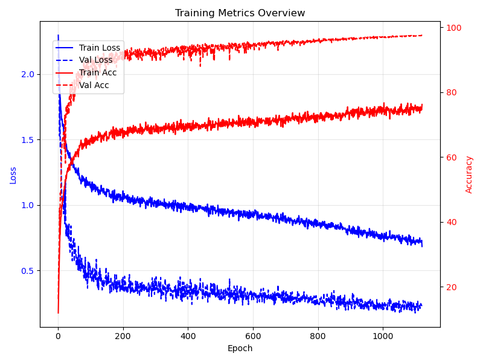

# A Pytorch Implementation of PyramidNet + ShakeDrop + Cutout + Mixup 

This project showcases my second coding assignment for the [Deep Learning Course](https://openpsi-project.github.io/DeepLearning2025/). The goal of this project is to classify images into 10 categories using a high-resolution version of CIFAR. You can find instructions for downloading the dataset on the course website.

Additionally, I highly recommend this course to anyone interested in DL — Professor Wu is truly an excellent teacher.

## How to Run It? 

You can train this model using `train.py`. Below is an example script (for detailed explanations of these parameters, refer to lines 29–41 in `train.py`):

```
MASTER_ADDR=localhost MASTER_PORT=29500 python train.py \
    --depth 110 \
    --alpha 120 \
    --data-root-dir /media/aa/HDD1/ \
    --lr 0.05 \
    --batch-size 128 \
    --world-size 3 \
    --model-name Pyramid-110-120 \
    --epochs 1200 > 1.out
```

I trained this model using 3 RTX 3090 GPUs, so the provided script is designed for distributed GPU training. If you wish to train the model on a CPU (which will likely result in impractically long training times), you will need to modify the code accordingly.

## Implementation Details

My network architecture is based on the Pyramid Network [HKK17] with bottleneck residual units [He+15] and ShakeDrop regularization [Yam+19].

And for data augmentation, I apply random cropping, random horizontal flipping, random rotation, color jittering, and cutout [DT17].

Additionally, I incorporate mixup [Zha+18] to enhance model generalization.

## Result (test acc TBC)

**Note:** We provide the checkpoint file `models/cifar10_4x_best.pth` corresponding to the results shown below.



Val Acc: ~97.5%

### Hyperparameters

| **Parameter**         | **Value** | **Parameter**           | **Value**         |
|-----------------------|-----------|-------------------------|-------------------|
| **Pyramid Depth**     | 110       | **Epoch**               | 1200              |
| **Pyramid Alpha**     | 120       | **Learning Rate** (after warmup) | 0.05              |
| **SGD weight decay**  | 5e-4      | **batch size**          | 128               |
| **SGD momentum**      | 0.9       | **Warm-Up Epoch**       | 5                 |
| **Mixup Alpha**       | 1.0       | **Cutout Prob.**        | 0.5               |


## Reference

[He+15] Kaiming He et al. Deep Residual Learning for Image Recognition. 2015. arXiv: 1512.03385 [cs.CV]. url: https://arxiv.org/abs/1512.03385.

[DT17] Terrance DeVries and Graham W. Taylor. Improved Regularization of Convolutional Neural Networks with Cutout. 2017. arXiv: 1708.04552 [cs.CV]. url: https://arxiv.org/abs/1708.04552.

[HKK17] Dongyoon Han, Jiwhan Kim, and Junmo Kim. Deep Pyramidal Residual Networks. 2017. arXiv: 1610.02915 [cs.CV]. url: https://arxiv.org/abs/1610.02915.

[Zha+18] Hongyi Zhang et al. mixup: Beyond Empirical Risk Minimization. 2018. arXiv: 1710.09412 [cs.LG]. url: https://arxiv.org/abs/1710.09412.

[Yam+19] Yoshihiro Yamada et al. “Shakedrop Regularization for Deep Residual Learning”. In: IEEE Access 7 (2019), pp. 186126–186136. issn: 2169-3536. doi: 10 . 1109 / access . 2019 . 2960566. url: http://dx.doi.org/10.1109/ACCESS.2019.2960566.